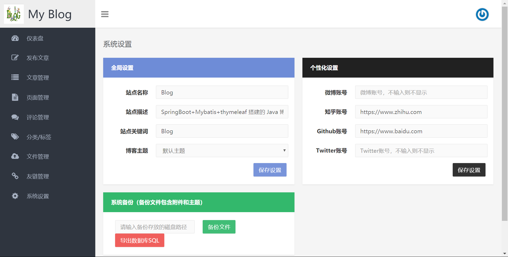
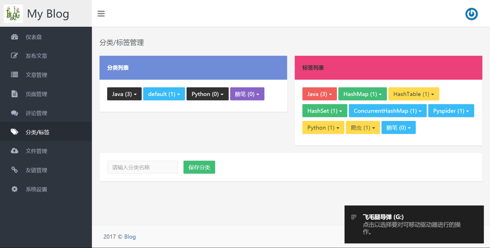
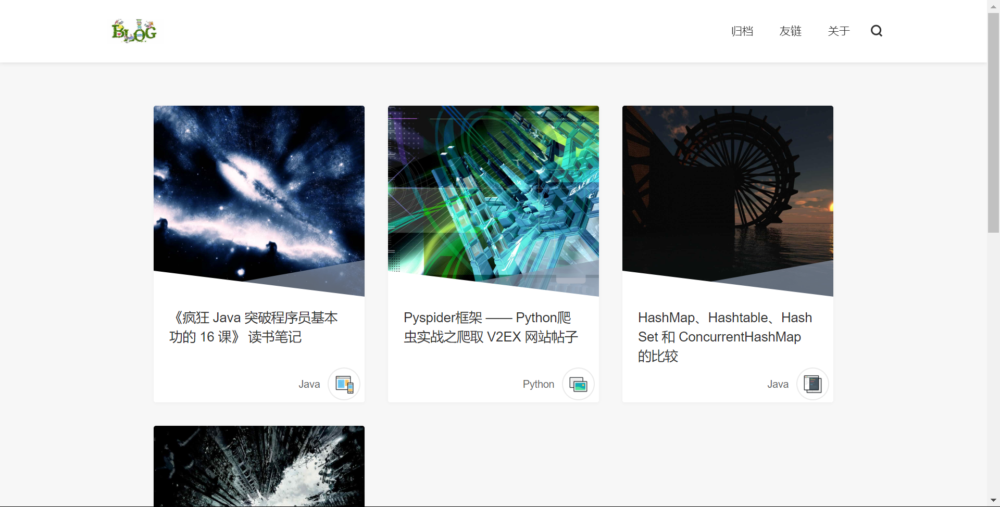

# 基于Springboot+Mybatis+thymeleaf的个人博客系统

#### 介绍
个人博客系统基于Spring Boot、Mybatis以及Thymeleaf进行开发，功能涵盖了文章发布与管理、页面管理、评论管理、分类标签设置、文件管理、友链管理和系统设置等多个方面。这一项目不仅遵循了良好的代码规范，结构清晰，而且技术栈选择得当，非常适合Java初学者及计算机专业的学生深入学习和实践。

#### 软件架构
前端：html | jquery | bootstrap  
后端：spring | springmvc | mybatis  
环境：jdk1.8 | maven | mysql | tomcat      

#### 功能介绍

##### 【功能详述】 

- 文章管理

    

- 页面管理

    

- 系统设置

    

- 文件管理

    

- 友链管理

    

- 标签管理

    

- 评论管理

    

- 发布文章

    

- 仪表盘

    

- 归档

    

- 登陆页面

    

- 仪表盘

    

- 首页

    

- 博客详情

    

#### 使用说明
1. 创建数据库，执行数据库脚本  
2. 修改jdbc数据库连接参数  
3. 下载安装maven依赖jar  
4. 启动SpringBoot启动类  

#### 后端管理

请求地址： http://localhost:8080/

用户名：admin

密码：123456   